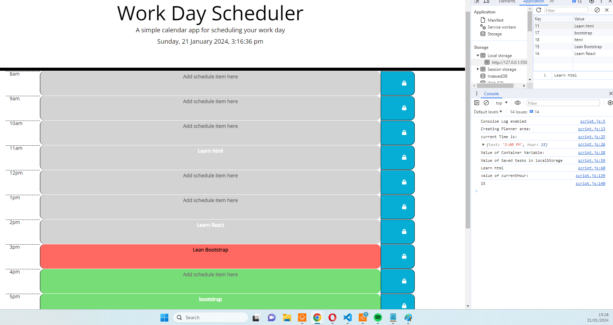
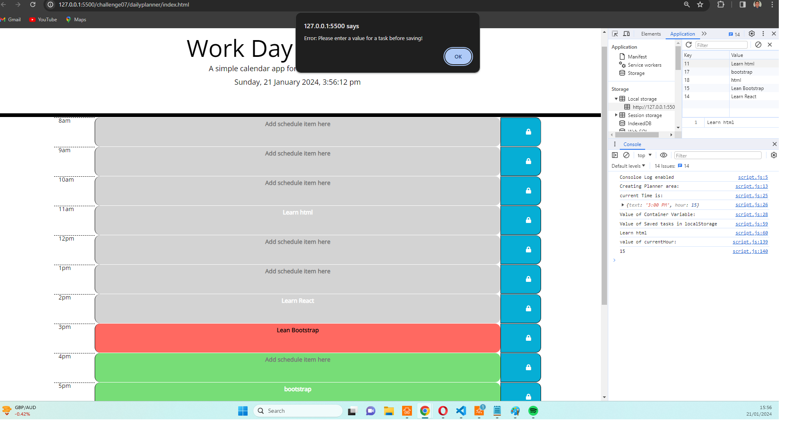

# Third-Party APIs: Work Day Scheduler

Challenge 07 corresponds to the creation of a simple calendar application that allows a user to save events for each hour of the day by modifying starter code. This app will run in the browser and feature dynamically updated HTML and CSS powered by jQuery.

The application will use DayJS library to format date and time attributes.

Main Application - Screen Capture 1

## Acceptance Criteria

The app should:

- Display the current day at the top of the calender when a user opens the planner.

- Present timeblocks for standard business hours when the user scrolls down.

- Color-code each timeblock based on past, present, and future when the timeblock is viewed.

- Allow a user to enter an event when they click a timeblock

- Save the event in local storage when the save button is clicked in that timeblock.

- Persist events between refreshes of a page

The following Screen captures demonstrates the application functionality operational:

## Screen Capture 1: Main Application operational with Console Log output and localStorage of timeblock text

(./images/ScreenCapture1.png)

## Screen Capture 2: Main Application showing Error capture so that no persistance of null timeblocks

